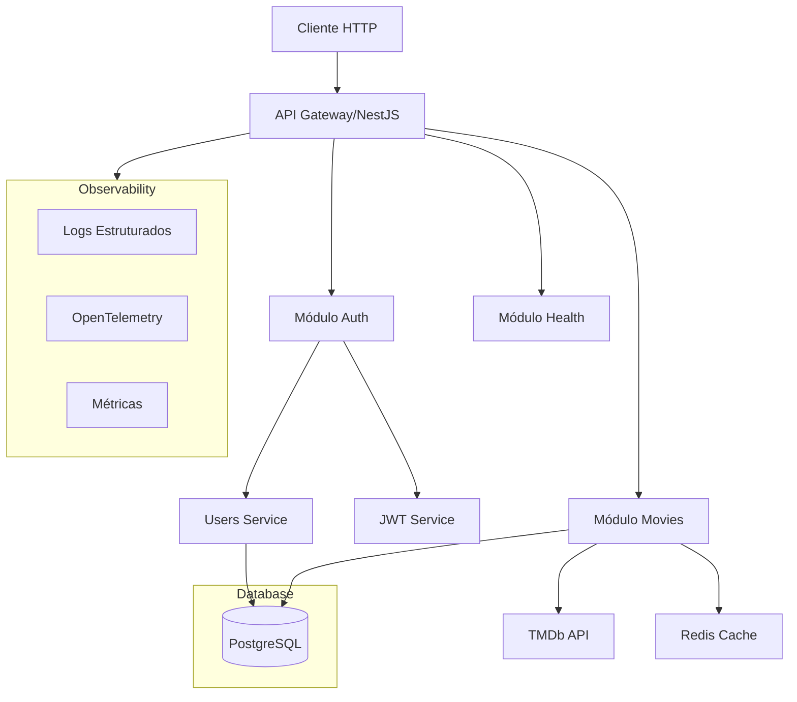
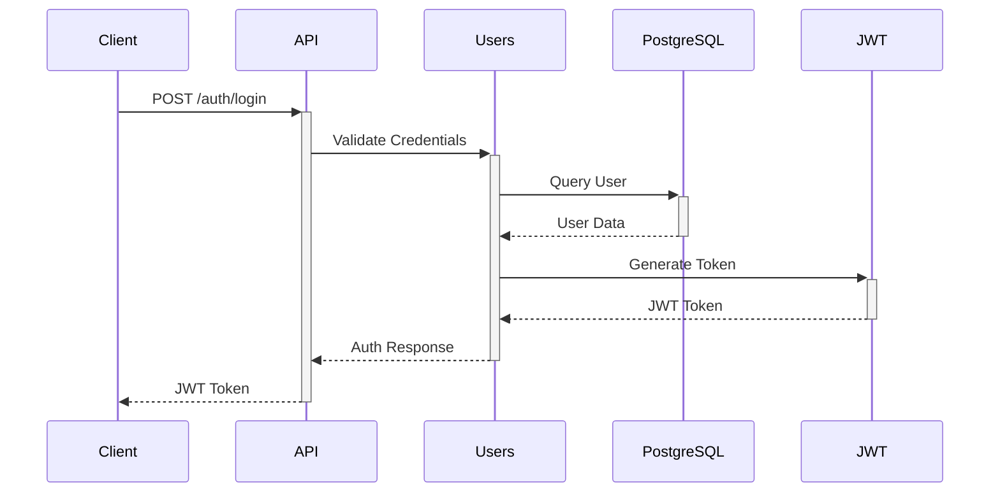
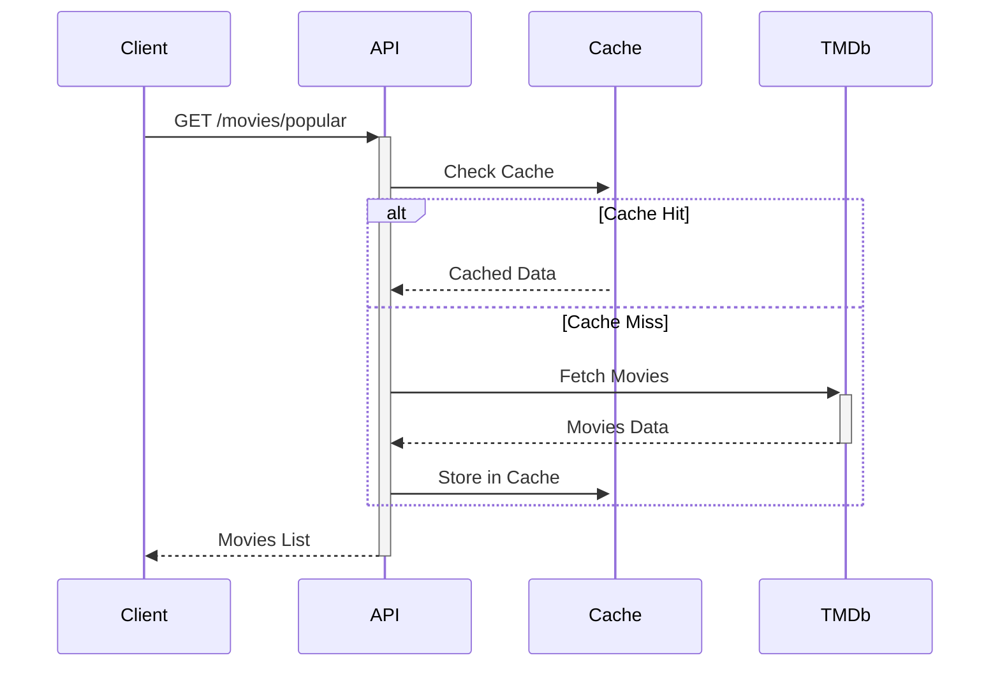

# Arquitetura do Sistema - WatchMe

## Visão Geral da Arquitetura

## Componentes Principais

### 1. API Gateway (NestJS)
- Gerenciamento de rotas
- Middleware de autenticação
- Interceptors para logging e tracing
- Validação de requisições
- Tratamento de erros

### 2. Módulos

#### Auth Module
- Registro de usuários
- Autenticação via JWT
- Gerenciamento de sessão
- Hash de senhas

#### Movies Module
- Integração com TMDb API
- Cache de resultados
- Tracking de visualizações
- Gerenciamento de estado

#### Health Module
- Healthcheck dos serviços
- Monitoramento de dependências
- Status da aplicação

### 3. Serviços de Infraestrutura

#### Cache (Redis)
- Cache de filmes populares
- Cache de detalhes de filmes
- TTL configurável
- Invalidação automática

#### Database (PostgreSQL)
- Persistência de dados
- Migrations automáticas
- Índices otimizados
- Backup automático

### 4. Observabilidade

#### Logging
- Logs estruturados em JSON
- Contexto de requisição
- Níveis de log configuráveis
- Rotação de logs

#### Tracing (OpenTelemetry)
- Trace ID em todas requisições
- Spans para operações importantes
- Métricas de latência
- Contexto distribuído

## Fluxos Principais

### 1. Autenticação

### 2. Busca de Filmes

## Considerações de Segurança

1. **Autenticação**
   - JWT com expiração
   - Refresh tokens
   - Rate limiting

2. **Dados**
   - Senhas hasheadas
   - HTTPS
   - Validação de entrada

3. **Cache**
   - TTL definido
   - Invalidação manual
   - Chaves únicas

## Escalabilidade

1. **Horizontal**
   - Stateless design
   - Cache distribuído
   - Load balancing

2. **Vertical**
   - Query optimization
   - Connection pooling
   - Resource limits 