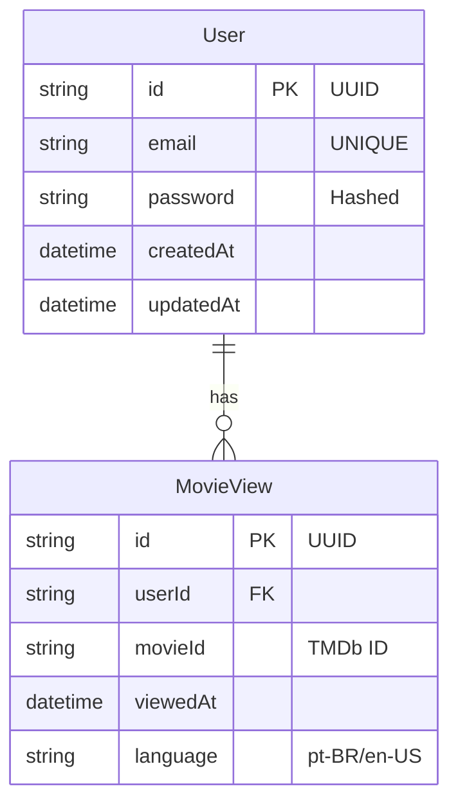
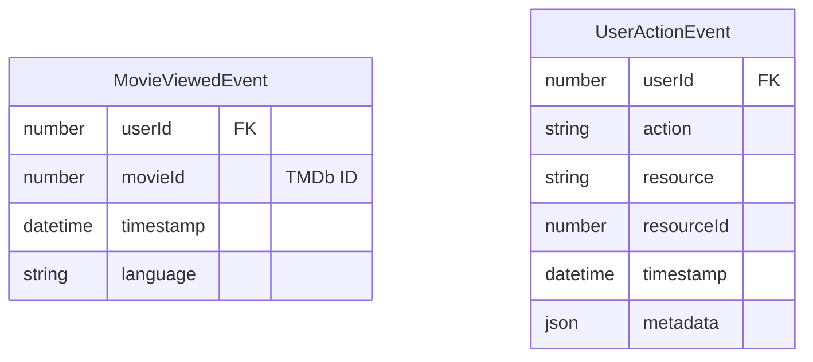
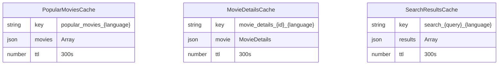

# Diagrama ERD - WatchMe

## Entidades e Eventos

### Entidades Persistentes (PostgreSQL)

### Eventos (Kafka)

### Cache (Redis)

## Descrição das Entidades

### Entidades PostgreSQL
#### User
- **id**: Identificador único do usuário (UUID)
- **email**: Email do usuário (único)
- **password**: Senha hasheada
- **createdAt**: Data de criação
- **updatedAt**: Data da última atualização

#### MovieView
- **id**: Identificador único da visualização (UUID)
- **userId**: ID do usuário que visualizou (FK)
- **movieId**: ID do filme no TMDb
- **viewedAt**: Data/hora da visualização
- **language**: Idioma da visualização

### Eventos Kafka
#### MovieViewedEvent
- **userId**: ID do usuário que visualizou
- **movieId**: ID do filme visualizado
- **timestamp**: Data/hora do evento
- **language**: Idioma da visualização

#### UserActionEvent
- **userId**: ID do usuário
- **action**: Tipo da ação
- **resource**: Recurso afetado
- **resourceId**: ID do recurso (opcional)
- **timestamp**: Data/hora do evento
- **metadata**: Dados adicionais do evento

### Cache Redis
#### PopularMoviesCache
- Cache de filmes populares por idioma
- TTL: 5 minutos

#### MovieDetailsCache
- Cache de detalhes de filmes por ID e idioma
- TTL: 5 minutos

#### SearchResultsCache
- Cache de resultados de busca por query e idioma
- TTL: 5 minutos

## Relacionamentos

1. User -> MovieView
   - Um usuário pode ter várias visualizações de filmes
   - Uma visualização pertence a um único usuário
   - Relacionamento: 1:N

2. User -> Events
   - Eventos são gerados a partir de ações do usuário
   - Eventos são processados assincronamente
   - Não há relacionamento direto no banco

## Índices
- `users.email`: UNIQUE
- `movie_views.userId`: INDEX
- `movie_views.movieId`: INDEX
- `movie_views.viewedAt`: INDEX

## Observações
- Os dados dos filmes são obtidos da API TMDb, não são armazenados localmente
- Senhas são armazenadas com hash criptográfico
- UUIDs são usados como identificadores primários para maior segurança
- Eventos são processados de forma assíncrona via Kafka
- Cache é gerenciado automaticamente com TTL 