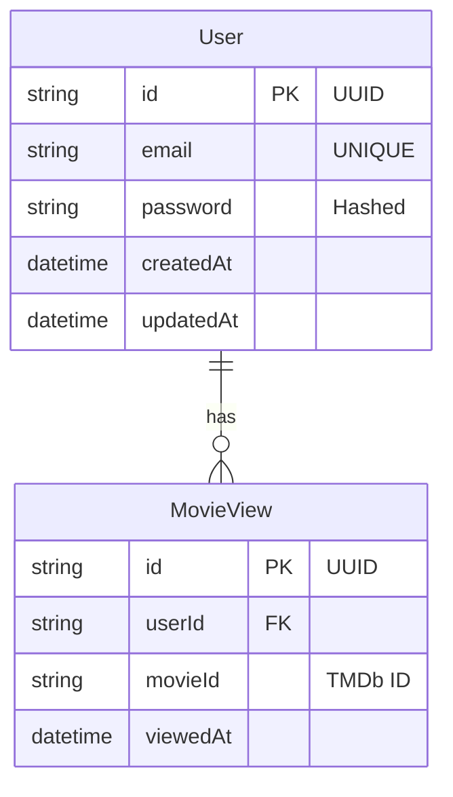

# Diagrama ERD - WatchMe

## Entidades

### User

## Descrição das Entidades

### User
- **id**: Identificador único do usuário (UUID)
- **email**: Email do usuário (único)
- **password**: Senha hasheada
- **createdAt**: Data de criação
- **updatedAt**: Data da última atualização

### MovieView
- **id**: Identificador único da visualização (UUID)
- **userId**: ID do usuário que visualizou (FK)
- **movieId**: ID do filme no TMDb
- **viewedAt**: Data/hora da visualização

## Relacionamentos

1. User -> MovieView
   - Um usuário pode ter várias visualizações de filmes
   - Uma visualização pertence a um único usuário
   - Relacionamento: 1:N

## Índices
- `users.email`: UNIQUE
- `movie_views.userId`: INDEX
- `movie_views.movieId`: INDEX

## Observações
- Os dados dos filmes são obtidos da API TMDb, não são armazenados localmente
- Senhas são armazenadas com hash criptográfico
- UUIDs são usados como identificadores primários para maior segurança 